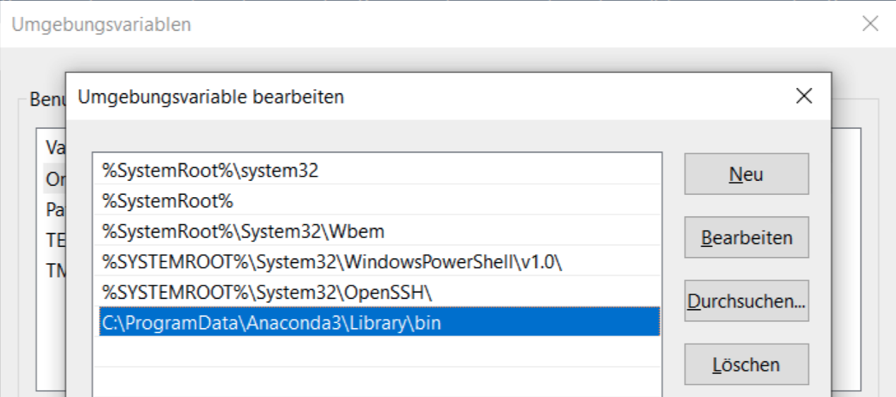

# Andaconda for Windows

## Create unmutable environment Jupyter Notebook environment for unprivileged users

requirements.yaml for CPU tasks
---

```
channels:
  - defaults
  - conda-forge
dependencies:
  - conda-forge::ncurses # fixes warning about libtinfo.so missing version information
  - ipykernel # vscode
  - ipython # vscode
  - kneed
  - matplotlib
  - notebook
  - numba
  - numpy
  - openpyxl
  - pandas # vscode
  - pyDOE
  - python>=3.9
  - scikit-learn<=0.24.1
  - seaborn
  - pip
  # - pip:
```

Add Anaconda3 bin directory to system path (admin)
---



```
C:\ProgramData\Anaconda3\Library\bin
```

Create new environment in C:\ProgramData\Anaconda3\envs (admin)
---

```
> conda create -n ENVIRONMENT_NAME -f requirements.yaml
```

Copy an environment from in C:\ProgramData\Anaconda3\envs (admin)
---

```
> conda create --name DST_ENVIRONMENT_NAME --clone SRC_ENVIRONMENT_NAME
```

Start jupyter notebook (non-privileged)
---

Run without token and password and connect to [http://localhost:8888](http://localhost:8888)

```
> cd
> C:\ProgramData\Anaconda3\python.exe C:\ProgramData\Anaconda3\cwp.py C:\ProgramData\Anaconda3\envs\ENVIRONMENT_NAME C:\ProgramData\Anaconda3\envs\ENVIRONMENT_NAME\python.exe C:\ProgramData\Anaconda3\envs\ENVIRONMENT_NAME\Scripts\jupyter-notebook-script.py --no-browser --NotebookApp.token='' --NotebookApp.password='' --notebook-dir=C:\TEMP --ip=127.0.0.1
```

Copy environment and start jupyter notebook (non-privileged) Powershell alternative
---

Run without token and password and connect to [http://localhost:8888](http://localhost:8888)

```
powershell.exe -ExecutionPolicy ByPass -NoExit -Command "& 'C:\ProgramData\Anaconda3\shell\condabin\conda-hook.ps1' ; conda activate 'C:\ProgramData\Anaconda3' ; conda create --name exam --clone juno ; conda activate exam ; jupyter notebook --no-browser --NotebookApp.token='' --NotebookApp.password='' --notebook-dir=C:\TEMP --ip=127.0.0.1"
```
