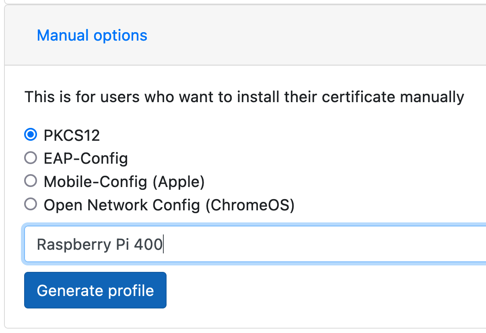
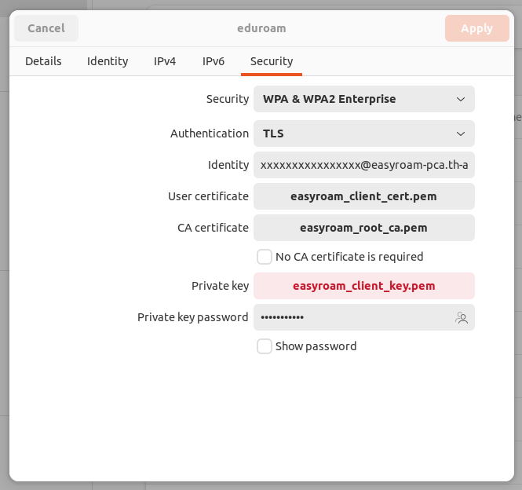

# Eduroam in NetworkManager (PKCS#12):

First, generate a new profile on [https://www.easyroam.de/User/Generate](https://www.easyroam.de/User/Generate).
---



Next, export user certificate and key and ca certificate from your downloaded __.p12__ file:
---

An import password is not required since no password is set. However, you should protect your RSA key. This password is then needed to use the key file in the setup later.

```
Enter Import Password: <-- Skip those lines with enter
writing RSA key
Enter pass phrase: <-- Don't skip that to protect the usage of key
Verifying - Enter pass phrase: <-- Don't skip that to protect the usage of key
```


```
KEYFILE='YOUR FILENAME FROM EASYROAM.p12'
```

```
echo "export client cert" &&
openssl pkcs12 -in "$KEYFILE" -legacy -nokeys > easyroam_client_cert.pem
```

```
echo "export private key" &&
openssl pkcs12 -legacy -in "$KEYFILE" -nodes -nocerts | openssl rsa -aes256 -out easyroam_client_key.pem
``` 

```
echo "export ca certs" &&
openssl pkcs12 -info -in "$KEYFILE" -legacy -nokeys > easyroam_root_ca.pem
```

Finally, setup NetworkManger:
---

(Replace the xxxxx's with the name in the user certificate!)

