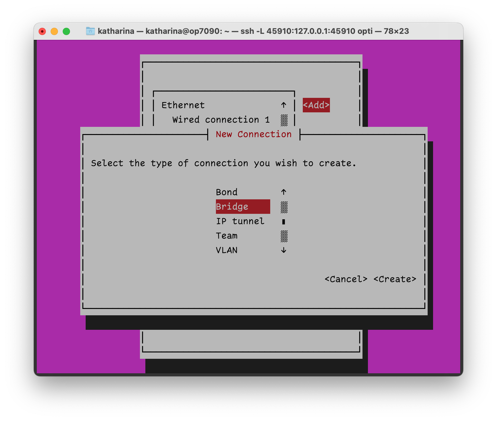

# Bridged networking with KVM

1. Create bridge network device with NetworkManager
---

Run the terminal app for super easy bridge setup:

```
sudo nmtui
```
Leave your ethernet device as-is:


Create a new connection:


Select _Add_ and _Bridge_ as a new connection type:



Set a nice profile name and enter a device name for the bridge. Then add a new ethernet connection that the bridge can use to communicate with the physical network:


Select _Show_ to open the IP configuration and setup the IP address for the bridge device. Add a gateway if the ethernet device you've selected is your main internet connection:


Check _Automatially connect_ and _Available to all users_:


Next, activate the bridge:


2. Create XML bridge file
---

This file describes a network _kvm_bridge_ that works as a bridge.

```
<network>
    <name>kvm_bridge</name>
    <forward mode="bridge" />
    <bridge name="br0" />
</network>
```


2. Create bridge network in virsh
---

```
virsh # net-define bridge.xml
virsh # net-list --all
virsh # net-start kvm_bridge
virsh # net-autostart kvm_bridge
```

3. Change VM network to bridge
---

```
virsh # edit VM_NAME
```

Change bridge from _virbr0_ to _br0_:

