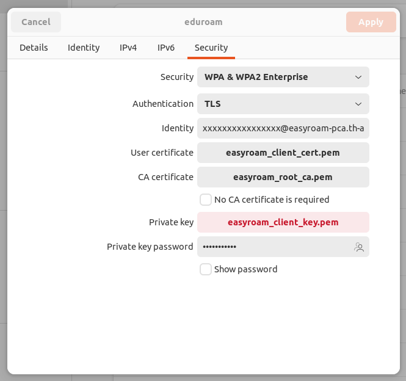

# Linux shell


Eduroam for NetworkManager (PKCS#12):
---

First, export user certificate and key and ca certificate:

```
KEYFILE='YOUR FILENAME FROM EASYROAM.p12'
```

```
echo "export client cert"
openssl pkcs12 -in "$KEYFILE" -legacy -nokeys > easyroam_client_cert.pem

echo "export private key"
openssl pkcs12 -legacy -in "$KEYFILE" -nodes -nocerts | openssl rsa -aes256 -out easyroam_client_key.pem

echo "export ca certs"
openssl pkcs12 -info -in "$KEYFILE" -legacy -nokeys > easyroam_root_ca.pem
```

Next, setup NetworkManger:

(Replace the xxxxx's with the name in the user certificate!)


