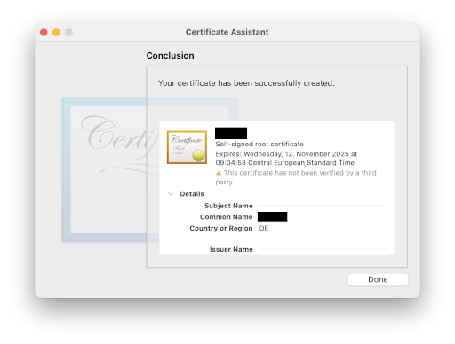

# macOS Gatekeeper (aka why I can't run my app)

This title is a bit unfair because apps without signatures might come with real danger. The macOS Gatekeeper does a very good job: __Preventing__ you from __installing Malware and friends__. But it may also hit any trustworthy apps that are not signed like some open source apps.

Running unsigned apps since Sequoia 15.1 is not possible anymore. Great! So what now? __Enlighten yourself and become best-practice by signing your own apps.__ Proceed with caution* when downloading apps is still mandatory.

*Caution - what's a good practice from a simple cyber security perspective:

- [__Mandatory__] Download app maintainer origin versions (website or github releases)
- [__Strongly recommeded__] Verify checksums or digital signatures if available (sha256, gpg)
- [__Optional__] Use online/offline virus check if you have a trustworthy download source (e.g. University hosted apps, but that won't provide any more trustworthiness of the downloaded app)
- [__None of above items apply__] Move app to trash and don't run it (if there is no way to verify it)


Code signing docs: https://developer.apple.com/library/archive/documentation/Security/Conceptual/CodeSigningGuide/Procedures/Procedures.html

Create your sign identity
---

1. Open Spotlight Search (not App search!)
2. Search for _Keychain Access.app_

3. Enter an ID you'd like to name your identity - this is mandatory for using it later in the terminal so don't get too crazy here. Also, you must change the __Certificate Type__ to __Code Signing__:


4. Your identity is valid for __1 year__ by default - that's fine because you always can create a new identity and sign your apps freshly:


5. This is what you should have:


6. Add Terminal.app to allow __Full Disk Access__ - you can find that in Privacy & Security in the System Settings App. This is mandatory to allow you to sign apps. You can revert that change after signing your app.

Signing an app: FAUbox
---

1. Remove any existing signatures:

```
codesign --remove-signature /Applications/FAUbox.app
```

2. Signing app properly (cyber hacker style of course :P). Enter your login password and proceed:

```
codesign --force --sign YOUR_IDENTITY_NAME /Applications/FAUbox.app
```


Well done! You have properly made your own digital signature. You can check your signature too - __Autority=__ should have your correct ID:

```
codesign -dv --verbose=2 /Applications/FAUbox.app

Executable=/Applications/FAUbox.app/Contents/MacOS/FAUbox
Identifier=de.dal33t.powerfolder.PowerFolder
Format=app bundle with Mach-O thin (x86_64)
CodeDirectory v=20400 size=314 flags=0x0(none) hashes=3+3 location=embedded
Signature size=1725
Authority=YOUR_IDENTITY_NAME
Signed Time=12. Nov 2024 at 09:27:18
Info.plist entries=15
TeamIdentifier=not set
Sealed Resources version=2 rules=13 files=384
Internal requirements count=1 size=112
```

This way you can tell that the app was checked by you and when.

I dont care!!! Just work now!!!
---

If you absolutely don't care about your system security at all, you can fake the signature of an app. It's not signing at all and don't freak out if that won't work:

Ad-hoc signing app without a cryptographic identity:

```
codesign --force --sign - /Applications/FAUbox.app
```
