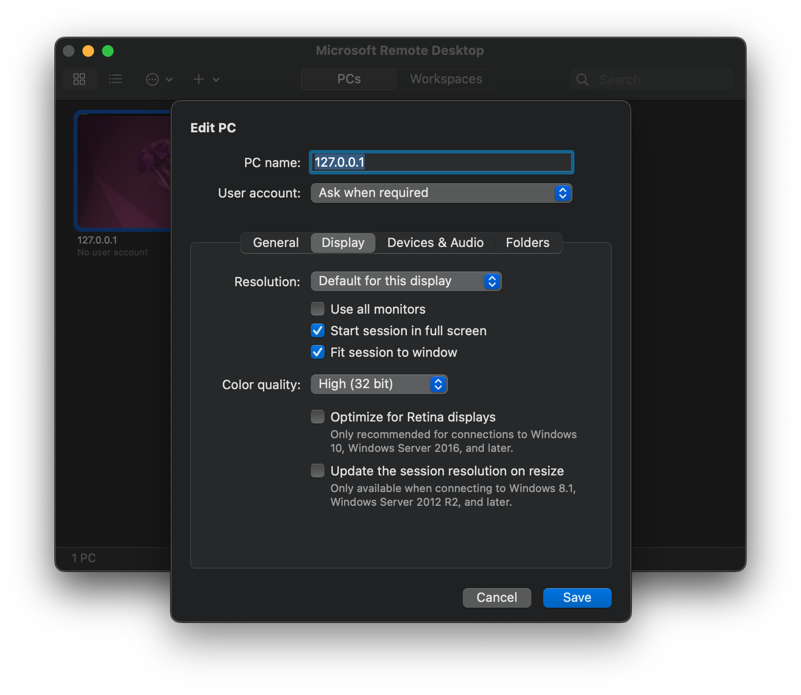

# Remote desktop with X11

rdp/X11/gdm login it is, until this is solved: https://gitlab.gnome.org/GNOME/gnome-remote-desktop/-/issues/92


## Install xrdp and check service

```
sudo apt install xrdp
```

## Configure xrdp for ssh tunnel only

```
; just listen on 127.0.0.1
port=tcp://.:3389

; error is fine (default is info)
LogLevel=error
```

## Configure easy to use ssh tunnel entry on your local computer

```
Host hpc-rdp
        Hostname 192.168.2.123 # IP to your remote computer
        Port 22 # optional, modify to your needs or delete line!
        IdentityFile ~/.ssh/my_key # your ssh key to use
        LocalForward 127.0.0.1:3389 127.0.0.1:3389 # listener:port destination:port
```

Remember to setup ssh key authentication on your destination host!

## Connect via rdp to your remote computer

1. Establish ssh tunnel

```
ssh hpc-rdp
```

2. Connect via rdp

Since a ssh tunnel is used, you can just connect to localhost:



Enjoy remote desktop :)